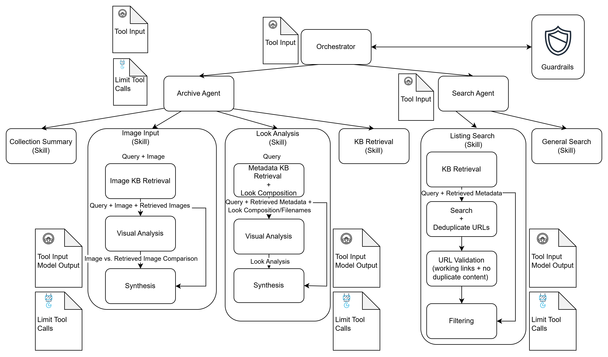

# DH-Agent: Dior Homme Archive Assistant
This project implements a multi-agent fashion archive through Strands specializing in Dior Homme. Powered by the Amazon Nova Pro foundation model, the agent reasons over a multimodal knowledge base of runway look images and structured look breakdown data. For accurate answer synthesis, it utilizes two primary agents-one for knowledge base analysis, and one for web search-each equipped with specialized toolsets and workflows designed for high-quality retrieval.



## Setup
1. Dependencies
   This project uses uv for dependency management. Ensure it is installed on your system.

2. Create a virtual environment and sync dependencies:
   `uv sync`

3. Configuration
   The project is configured to pull environment variables from AWS Secrets Manager. Ensure your environment is authenticated with the AWS CLI:
   `aws configure`

## Usage
To start the API, run:
```
uv run uvicorn agent:app --host {address} --port {port}
```

To query the agent after, send a POST request to the invocations endpoint in a second terminal:
```
curl -X POST http://{address}:{port}/invocations \
  -H "Content-Type: application/json" \
  -d '{
    "input": {"prompt": "What does look 1 consist of?"}
  }'
```